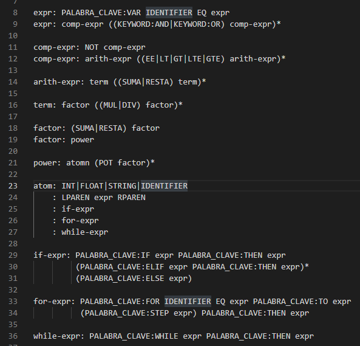

# Lenguaje de Programacion 

## Resumen General de funcionamiento 

Este lenguaje esta basado en **BASIC** (es un LP de proposito general con estructuras sencillas y no esta especializado en ningun tipo de aplicacion)

Para comprender las generalidades del lenguaje debemos saber lo siguiente:

Para la ejecucion de este proyeco necesitamos:
1. `basic.py` esta archivo contiene Lexer, Tokens, Analizador, el Interprete y mas clases necesarias para el funcionamiento.
2. `shell.py` en este archivo podremos ejecutar nuestro lenguaje.
3. `strings_with_arrows_strings` 

### TOKEN
En esta clase se hace match con la lista de tokens definida a continuacion:

### ERRORES
Este lenguaje tiene un manejo de errores con los siguientes metodos:

- `IllegalCharError` caracter incorrecto
- ` ExpectedCharError` caracter no esperado
- `InvalidSyntaxError` sintaxis invalida

### LEXER
La clase `class Lexer` se encargara de revisar caracter por caracter y dividir la entrada (texto) en una lista de tokens. En esta clase nos encontramos con metodos como:

- `advance()` es un metodo que permite moverse de una posicion a otra 
- `make_tokens` crea una lista de tokens identificando si es un digito una letra o si corresponde con un elemento en la lista de tokens.
- `make_number` es un metodo para poder diferenciar entre un numero flotante y un numero entero, siempre que recibamos una entrada 2.5 se tomara como un FLOAT 
- `make_string` es un metodo que identifica cuando hay una cadena de texto. Sintaxis "cadena"
- `make_identifier` en este metodo se realiza la identificacion de las palabras clave o reservedas con las que cuenta nuestro lenguaje 
- `make_not_equals` se distinguen casos en los que tengamos != 
- `make_equals` se distinguen casos en los que tengamos ==
- `make_less_than` distingue operaciones <=
- `make_greater_than` operaciones >=

### NODOS
Esta clase lo que hace es darnos la facilidad de poder movernos a trabes de todo el arbol que se va generando

### PASER, PARSER RESULTADO
Realizsan un seguimiento del indicie actual de token similar al `Lexer`

### ANALIZADOR
Es una de las clases mas importantes de nuestro codigo, en esta clase se transforman las reglas de la gramatica del lenguaje. Los metodos en esta clase son los siguientes:

- `term` verificar si tenemos operaciones multiplicacion y division por un factor
- `factor` verificar operaciones sumas, restas, potencia 
- `atom` ayuda para expresiones en las que tengamos float, enteros, cadenas de texto, palabras clave y todos las sentencias o bucles de repiticion que tenemos disponibles en nuesttro lenguaje
- `expr` identificar palabras clave y tambien poder indentificar cuando se esta comparando un elemento y hay una palabra clave de por medio
- `comp-expr` toma los casos en la gramatica en donde tengamos (==,!=,<,>,<=,>=)
- `arith-expr` operaciones suma, resta 
- `power` toma los casos en los que tengamos operaciones con ^ que representa potencias
- `if-expr`
- `for-expr`
- `while-expr`

Estos metodos tienden a ser recursivos entre si porque lo que van buscando es hacer un march con la gramatica y dandole prioridad a las operaciones, la gramatica de nuestro lenguaje es la siguiente:

En este lennguaje contamos con una lista de `PALABRAS_CLAVE` que nos permmitiran trabajar con variables y sentencias de repeticion, asi nuestro lenguaje podra identificar cuales palabras son reservadas.
La lista de palabras clave es la siguiente:

### INTERPRETE 
Con la ayuda del trabajo realizado en el analizador, el interprete nos ayudara a traducir nuestro codigo
El metodo `visit` procesa el nodo en donde nos encontramos 
En este punto nuestro lenguaje tiene capacidad para poder distinguir en que momento se encuentra con una operacion de un solo numero, una operacion binaria

Teniendo listo el corazon del interprete, necesitamos ayudarle al programa a poder operar esas entradas que recibamos para esto creamos una clase `Number` que nos permitira realizar esas operaciones, en este punto la salida que se mostrara sera la siguiente:

## Como Ejecutar Pruebas en el Lenguaje 
### ESTRUCTURA DE ENTARDAS PERMITIDAS

#### Sintaxis para Variables
VAR 'nombrevariable' = 'valor'
Ej. VAR a = 10

